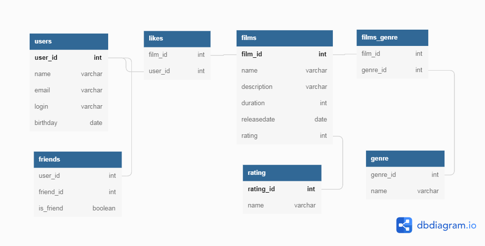

# java-filmorate
Template repository for Filmorate project.

// топ 10 популярных фильмов
SELECT films.name, count(likes.*) FROM films 
JOIN likes ON films.film_id=likes.film_id 
GROUP BY films.name
ORDER BY count(likes.*) DESC
LIMIT 10

//список общих друзей пети и васи
SELECT friends.friend_id from friends 
WHERE friends.user_id=users.user_id AND (users.name='Петя') AND
friends.friend_id IN (SELECT friends.friend_id from friends
WHERE friends.user_id=users.user_id AND (users.name='Вася'))
